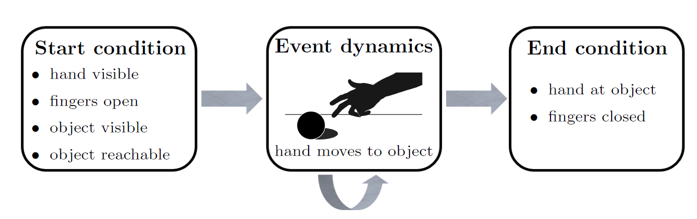
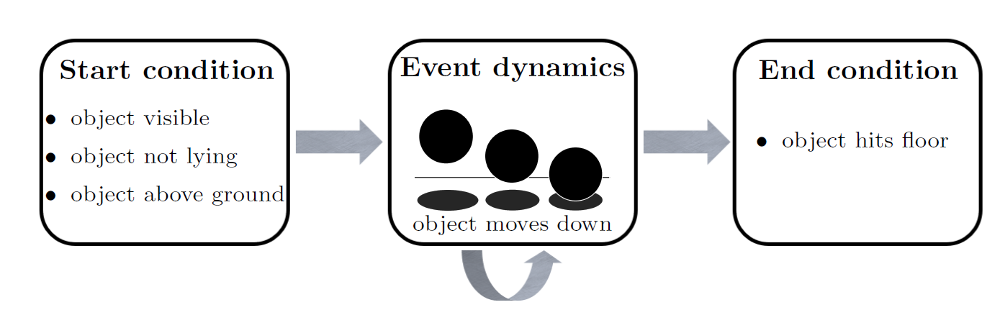
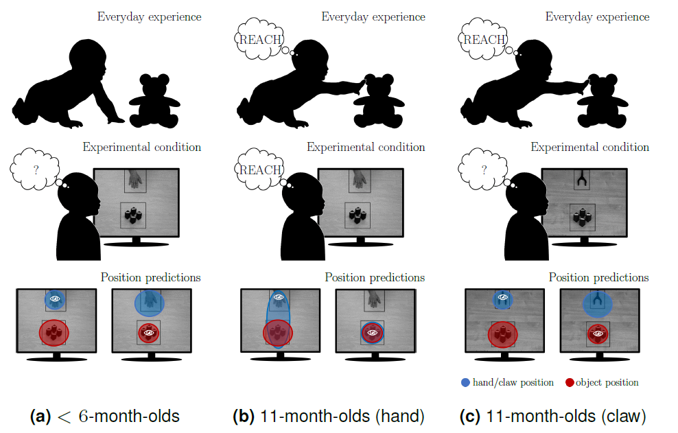

# Goal Anticipations via Event-Generative Inference

Source code for our event schematic inference system presented in *C. Gumbsch, M. Adam, B. Elsner, & M. V. Butz -Emergent Goal-Anticipatory Gaze in Infants via
Event-Predictive Learning and Inference*

## Overview

- *test.ipynd* provides a short walkthrough of the system.
- *event_inference.py* implements the event-predictive inference system.
- *interaction_gym.py* implements the agent-patient interaction scenario. *interaction_gym_rendering.py* takes care of some internal redering.
- *gaussian_networks.py* implements a shallow neural network that produces Gaussian distributions. The distributions are used within the event schemata
- *sampling_buffer.py* implements a buffer for efficient sampling, used to train the neural networks.
- *run_experiment.py* and *run_experiment2.py* run the experiments presented in the paper.

## Extended Abstract

Goal-predictions have been studied in infants in the context of the **goal-anticipatory gaze**.
If infants observe an action event (e.g., reaching) and look at the goal of the action (e.g., reaching target) before the action is completed, this is considered a goal-anticipatory gaze.
However, the occurance of a goal-anticipatory gaze in infants depend on various factors, such as familiarity with the agent, the infant's ability to produce the action event themselves, and agency cues shown by the agent.
The underlying cognitive mechanism for that have been heavily debated.
We propose that the goal-anticipatory gaze might emerge from the aim of the predictive brain, to minimize predicted uncertainty, coupled with the event-structure in which the world is perceived in.
We investigate this proposal by implementing a computational model, that is tested in a scenario inspired by how goal-anticipation was analyzed in infants.

Our system learns schematic representations of events that attempt to model, (1.) how the event typically starts, (2.) how the event unfolds over time, (3.) which conditions have to be met for the event to end.
Below are two examples of typical event schemata:

 

The system learns these event schemata starting via supervised training. 
At a later stage of training, the system infers the activation of an event schema based on maximizing the likelihood of incoming sensory observations.
Actions are chosen by attempting to minimize predicted uncertainty about future events and event-boundaries.
In this way the system, for example, chooses its gaze based on where it expects to get the most information about future events.
If events are recognized, this can result in a goal-predictive gaze, illustrated below.

